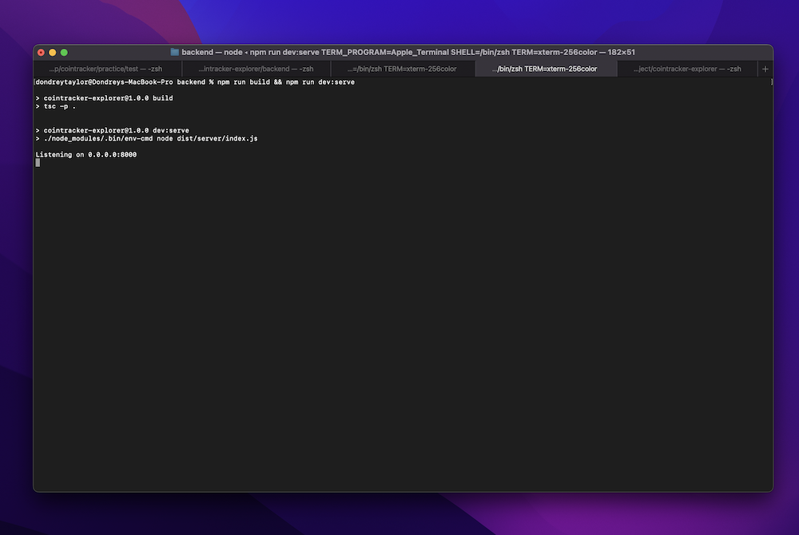
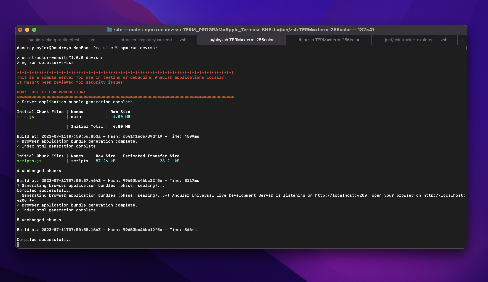
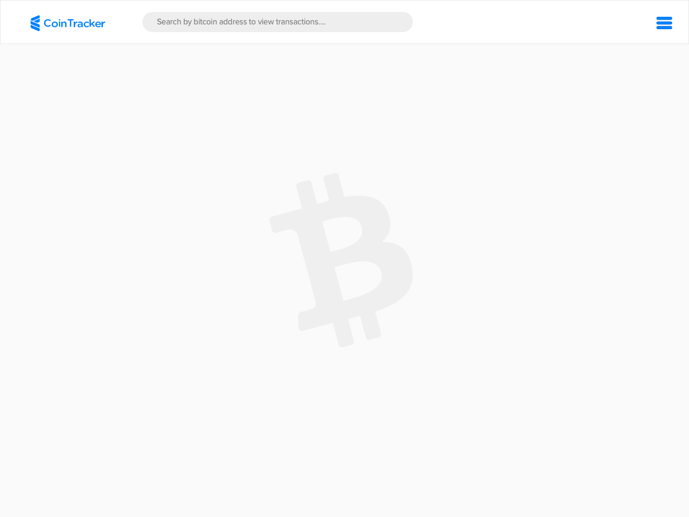
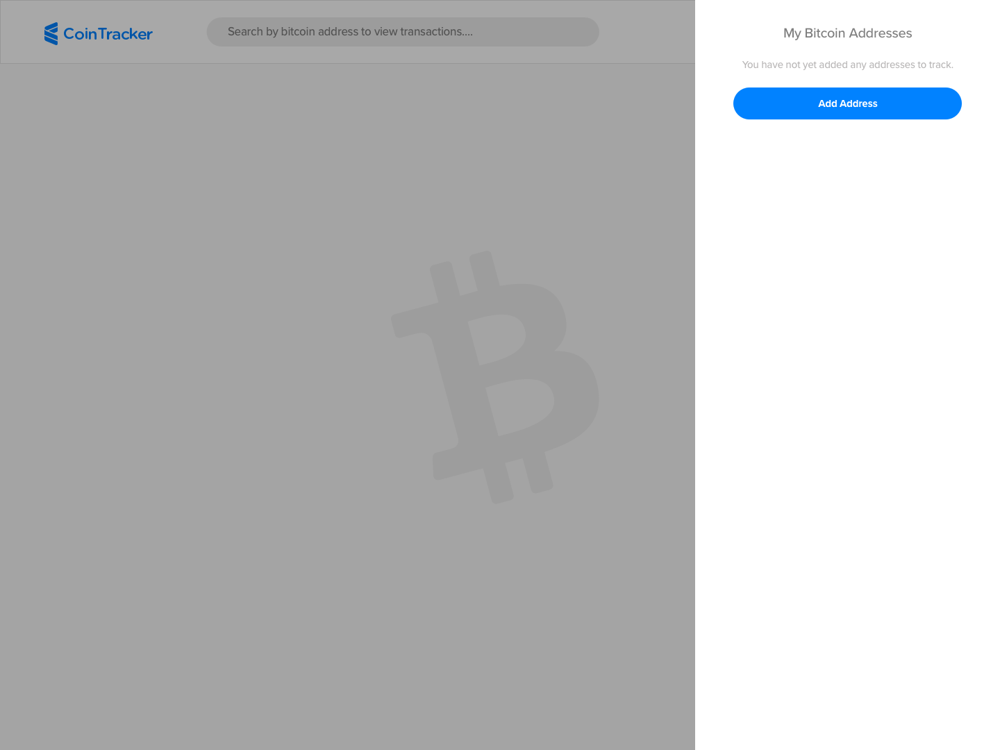
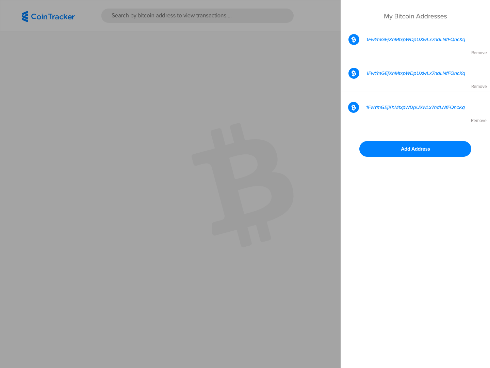
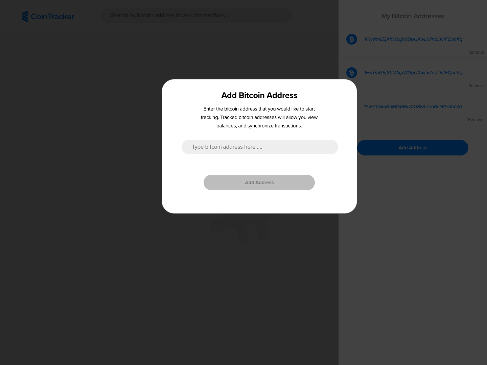
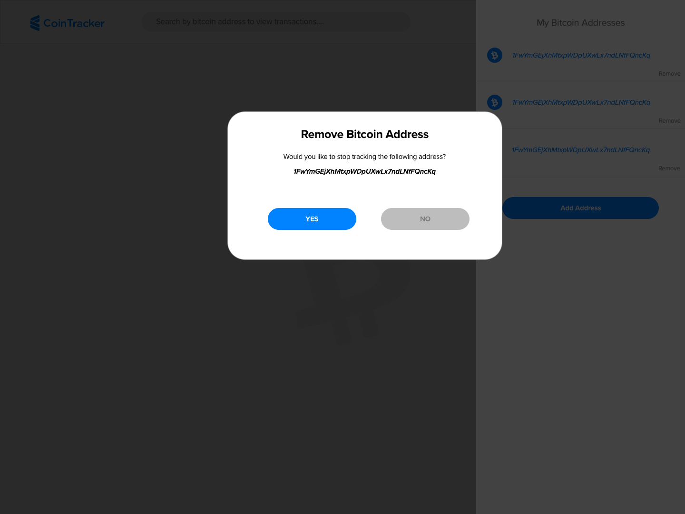
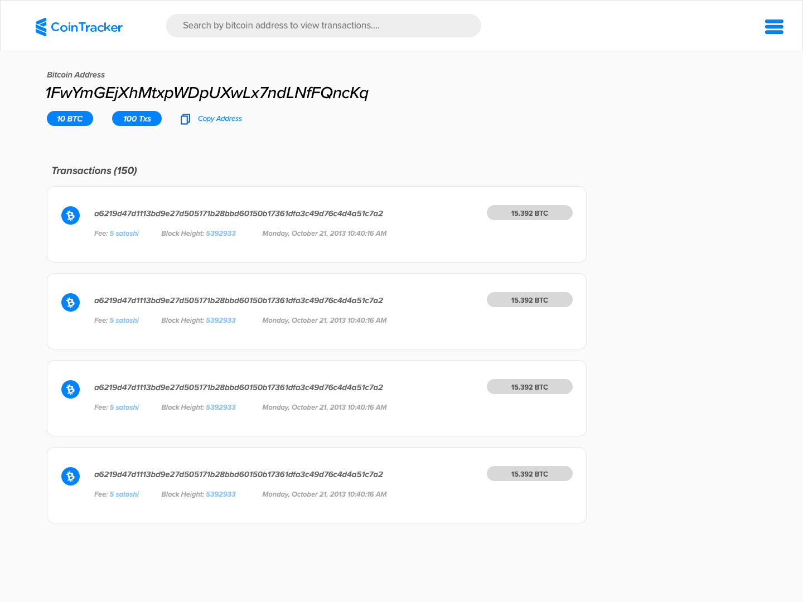
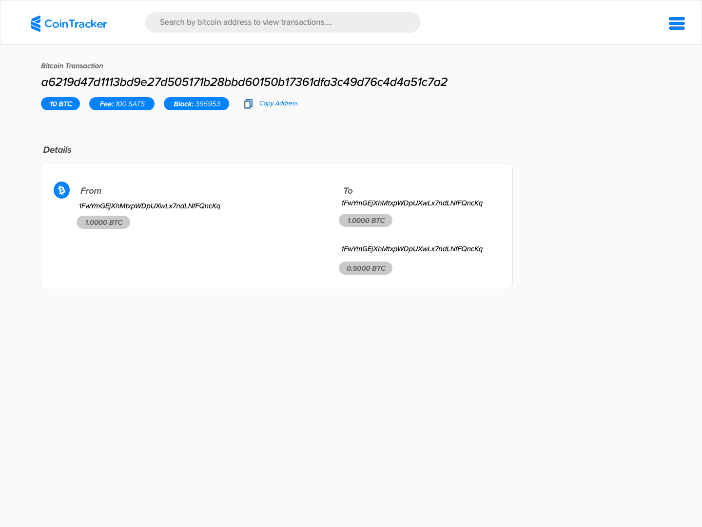

## Introduction

The following is a demonstration of a progressive web application responsible for tracking Bitcoin (BTC) address transactions, balances, and related data. 

The technologies used for this demo includes:
- Node (version 16.15.1)
- Hapi Framework (version 21)
- Angular (version 14) setup for server-side rendering
- TypeScript + SASS

###  Running the Demonstration

To run this application you'll want to open two seperate tabs in terminal/CMD: one for running the backend code base, and the other tab for running the frontend. 

> **Please note:** Before running the following codebase, you must first ensure that you have installed NPM

To run the backend, first navigate to the `backend` folder within terminal/CMD and run the following to install dependencies:

```shell
npm install
```

After dependencies have been installed you can then start the backend server by building and then running the HTTP server:

```shell
npm run build && npm run dev:serve
```



Now that the backend has been started, we can proceed with running our frontend. To run the frontend, navigate to the `frontend` folder within terminal/CMD and run the following to install dependencies:

```shell
npm install
```

After dependencies have been installed you can then start the frontend angular codebase by building and then running it in development mode as a universal server-side rendering application:

```shell
npm run dev:ssr
```



At this point you can now interact with the demo by opening up a web browser and navigating to http://localhost:4200/.


###  Design

The entire UI for this demo can be found within the `design` folder; there you'll see a sketch filed named CoinTracker.sketch, as well as various previews of the application. 

The idea when thinking of this design was to keep things simple by minimizing the amount of clicks needed to navigate through the application. Each major piece of the UI would be developed in Angular as a seperate page, while smaller aspects would be developed as reusuale components. The following is a summary of each page/components purpose and my throught process for creating it.

#### **Page (Main)** 
The main page acts as the default landing page for the application. This is where the user can either look up information about a given BTC address or add an address that can be tracked in the background. Tracked addresses are meant to be swept for UTXOs and other relevant details in the background via some CRON JOB or scheduled process. For the purposes of this demo I opted not to implement the schedule background tasks to sweep addresses that have been tracked, and instead decided to focus on the API and UI. 


#### **Page (Side Bar - No Addresses)**
The sidebar is where users can add BTC addresses that they would like to track in the background. These addresses can either be added or removed within the sidebar. For the purposes of the demo, I'm only storing tracked addresses locally within the browser, however with more time, I would have implemented sessions and stored these addresses within a data store like MongoDB.


#### **Page (Side Bar - Addresses)**
This is the design for how the sidebar would look when addresses have been added. Once addresses appear they will see a remove option where they can remove addresses they no longer want tracked. 


#### **Page (Side Bar - Add Address)**
If the user chooses to add an address, tapping on the "Add Address" from the side bar will reveal a popup that looks like this. This popup accepts a P2PKH address or Base58 address, which is then used to ping `blockchain.info` for relevant details such as recent transactions and balances.


#### **Page (Side Bar - Remove Address)**
When a user taps on "remove" near the address they added in the side bar, the remove popup will appear asking them to confirm the removal. The functionality around address removal currently only removes an address from the browser, however given time to implement sessions, my plan would have been to manage this server side instead.


#### **Page (Address)**
Searching for information regarding a BTC address (either by using the search bar or clicking on an address) will bring up the address details page. The addresses's balance, and recent transactions will appear on this screen.


#### **Page (Transaction)**
Tapping on a transaction from the address page will reveal details about the transaction such as block, inputs, outputs, fees, etc. 



###  Frontend Development Decisionsa

While React could have been used to create the frontend of this demo, I decided to use Angular for a number or reasons including: out of the box page routing, reusuable component library, and tooling. To get a better understanding of how the application is structured on the frontend, I'll explain the folder structure.

- **dist** - This contains the TypeScript and SASS compiled code that can be excuted directly with node. Files in this folder a generated on each save/build.
- **dist_comprssed** - This contains the same files as dist/ except that they are tar gzipped for better compression
- **src/assets** - This contains all of the image and font assets that are used by Angular
- **src/environments** - Development and production environment variables
- **src/modules** - This contains all of the various components and modules of our application
- **src/modules/module-site** - This is where the core the site is located such as the different pages, core element used, and layouts that get invoked on route changes.
- **src/modules/module-shared** - This is common code shared between modules such as headers, footers, services, models, etc.

To communicate with backend endpoints, I created a dedicated service called `BlockchainCOM` which defines any and all endpoints used by the frontend. More information about endpoints in the following section.

> **Please Note**: There are some aspects of the frontend that I was unable to polish due to time constrant such as: validaton on the search and add address fields, and preventing non-BTC addresses from being added. 

###  Backend Development Decisions
