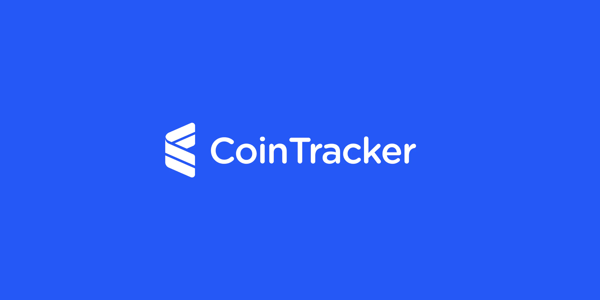
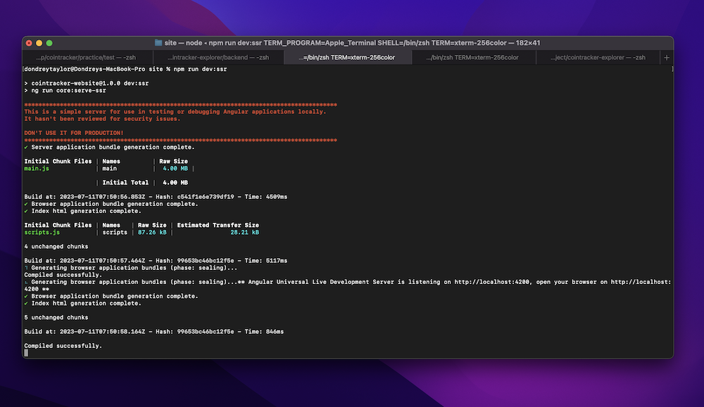

## Introduction

The following is a demonstration of a progressive web application responsible for tracking Bitcoin (BTC) address transactions, balances, and related data. 

The technologies used for this demo includes:
- Node (version 16.15.1)
- Hapi Framework (version 21)
- Angular (version 14) setup for server-side rendering
- TypeScript + SASS

###  Running the Demonstration

To run this application you'll want to open two seperate tabs in terminal/CMD: one for running the backend code base, and the other tab for running the frontend. 

> **Please note:** Before running the following codebase, you must first ensure that you have installed NPM

To run the backend, first navigate to the `backend` folder within terminal/CMD and run the following to install dependencies:

```shell
npm install
```

After dependencies have been installed you can then start the backend server by building and then running the HTTP server:

```shell
npm run build && npm run dev:serve
```


Now that the backend has been started, we can proceed with running our frontend. To run the frontend, navigate to the `frontend` folder within terminal/CMD and run the following to install dependencies:

```shell
npm install
```

After dependencies have been installed you can then start the frontend angular codebase by building and then running it in development mode as a universal server-side rendering application:

```shell
npm run dev:ssr
```



At this point you can now interact with the demo by opening up a web browser and navigating to http://localhost:4200/.


###  Design

The entire UI for this demo can be found within the `design` folder; there you'll see a sketch filed named CoinTracker.sketch, as well as various previews of the application. 

The idea when thinking of this design was to keep things simple by minimizing the amount of clicks needed to navigate through the application. Each major piece of the UI would be developed in Angular as a seperate page, while smaller aspects would be developed as reusuale components. The following is a summary of each page/components purpose and my throught process for creating it.

#### **Page (Main)**


#### **Page (Side Bar - No Addresses)**


#### **Page (Side Bar - Addresses)**


#### **Page (Side Bar - Add Address)**


#### **Page (Side Bar - Remove Address)**


#### **Page (Address)**


#### **Page (Transaction)**


###  Frontend Development Decisions

###  Backend Development Decisions
